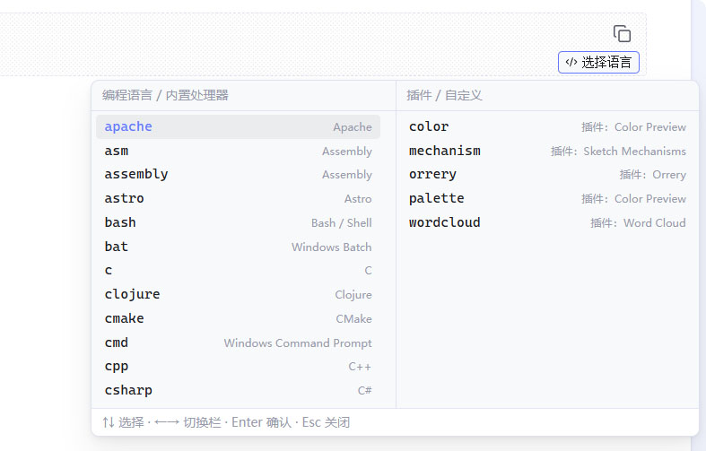
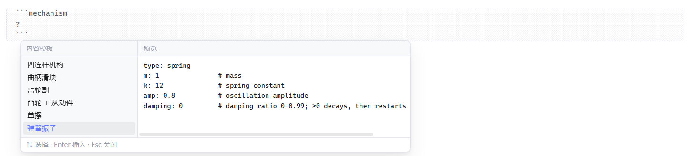
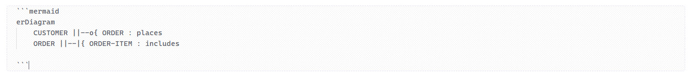
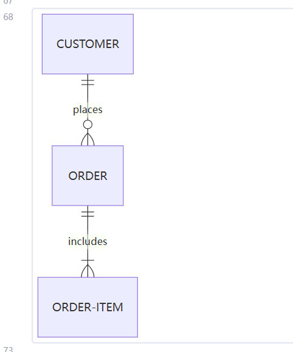

# Tips

**English** · [简体中文](README_ZH.md)

> Code blocks in Obsidian, as handy as they are in Typora: **hover a code block and pick the language**.

Tips is an Obsidian plugin that solves two things:

1. Obsidian has no language picker on code blocks — you have to type the info string by hand (` ```java `), which is easy to get wrong and tedious to type.
2. Many plugins (such as sketch-mechanisms and word-cloud) are triggered through code blocks, but over time you forget the activation name (`mechanism`, `wordcloud`, …).

Tips gathers **built-in languages + Obsidian's own processors (mermaid / math / query) + code block names registered by your installed plugins + your own custom entries** into a single two-column panel.



It also lets you store reusable templates — type `?` to bring them up whenever you need them.



## Features

### 1. Floating button on code blocks

Hover any code block and a button appears in the bottom-right corner showing that block's current language — **an instant answer to "what am I supposed to write here?"**. Click it to open the picker and switch languages.

Clicking the button **does not move your cursor**; picking a language only rewrites the language identifier, so your editing position is never disturbed.

### 2. Typing ``` opens the two-column picker

Type three backticks on an empty line and the picker appears immediately:

| Left column: languages / built-in | Right column: plugins / custom |
| --- | --- |
| `mermaid`, `python`, `java`, `bash`, … | Code block names registered by plugins (such as `mechanism`, `wordcloud`, …) plus your own entries |

Long entries are truncated with an ellipsis; hovering shows the full "entry — note" tooltip.

**Keep typing to filter**: after `j`, both columns narrow to matching entries. Filtering prefers prefix matches and also supports fuzzy matching, so `wc` still finds `wordcloud`.

Keyboard:

| Key | Action |
| --- | --- |
| `↑` / `↓` | Move within the current column; at the end it jumps to the other column |
| `←` / `→` | Switch columns |
| `Enter` / `Tab` | Confirm the selection |
| `Esc` | Close the panel |

You can also click an entry with the mouse.

Put the cursor on an existing info line (for example ```` ```java ````) and the panel opens with that line's content as the filter; editing the line updates results live.

The panel **always follows the cursor**. Even when it was opened from the corner button, as soon as you go back to editing the info line it moves from the button to the line you're editing — it never stays behind.

Entries are sorted **alphabetically** so you can find them by name (this can be switched back to the built-in frequency order in settings).

The panel is always anchored directly **below the cursor or the button** (flipping above when there isn't room below) and never shifts sideways. It stays flush against its anchor, so shrinking the content won't leave a gap; it closes automatically when you scroll the note or move away from the info line.

### 3. Where candidates come from

- **Built-in languages**: around 100 common language identifiers, with the full language name as the note.
- **Obsidian processors**: `mermaid`, `math`, `query`.
- **Plugin scan**: reads each plugin's `main.js` under the plugins folder, extracts names from `registerMarkdownCodeBlockProcessor("xxx", …)` and shows which plugin they belong to (disabled plugins are labelled).
- **Custom entries**: add or remove them in settings at any time (entry + note).

### 4. Content templates (no more memorising syntax)

Picking the right category is only the first step. Mermaid alone has a dozen diagram types, and other plugins come with their own variants — each with different syntax. Store the ones you use as **content templates**, then type `?` as the first character inside a code block to bring them up:

````markdown
```mermaid
?实体关系图
```
````

A panel appears (names on the left, a full preview on the right). Pick with `↑↓` and insert with `Enter` — **the whole code block body is replaced** and the cursor lands at the end of the new content.

- `?` must be the **first character** of the body, with no leading space, so `a ? b : c` never triggers it by accident
- Typing after `?` filters by **name** (the body is not searched), e.g. `?实体关系图`
- Templates are managed per entry under Settings → Tips → Content templates; paste a whole code block and the surrounding ```` ``` ```` is stripped for you
- Exports are split into three groups — **plugins / builtin / custom**:

```json
{
	"plugins": { "mechanism": [{ "name": "Four-bar linkage", "body": "type: fourbar" }] },
	"builtin": { "mermaid": [{ "name": "Pie chart", "body": "pie title X" }] },
	"custom": { "myblock": [{ "name": "Private template", "body": "..." }] }
}
```

The three groups are treated differently on import:

| Group | Behaviour |
| --- | --- |
| `plugins` | Imported when the plugin is installed, otherwise skipped entirely with a notice |
| `builtin` | Imported when the processor exists, otherwise skipped entirely with a notice |
| `custom` | Controlled by the "import non-plugin templates" switch; missing entries are created automatically with a blank note |

- You can copy to the clipboard or export a `tips.json` file; importing accepts pasted text or a chosen file
- Import is **additive**: identical entries are skipped, and entries you don't currently have are skipped with a notice

#### For plugin authors: ship templates with your plugin

If your plugin also works through code blocks, you can put reference templates in a `tips.json` inside your plugin folder — users get them automatically after installing, with no manual import:





The structure of `tips.json`:

```json
{
	"mermaid": [
		{ "name": "erDiagram","body": "erDiagram\n    CUSTOMER ||--o{ ORDER : places\n    ORDER ||--|{ ORDER-ITEM : includes"
      },
		{ "name": "......", "body": "........" }
	]
}
```

A few conventions:

- Keys are **code block identifiers**, values are arrays of templates (each with `name` and `body`)
- Do not include the surrounding fence in `body`
- This is **read-only**: nothing is written into the user's template list, and it disappears when your plugin is uninstalled
- Users can turn off "read templates bundled with plugins" in settings

## Installation

### Manual installation

1. Download or build `main.js`, `manifest.json` and `styles.css`.
2. Create `<vault>/.obsidian/plugins/tips/` inside your vault.
3. Put the three files in there.
4. Open Obsidian → Settings → Community plugins → turn off Restricted mode → enable **Tips**.

### Building from source

```bash
npm install
npm run dev     # watch mode, rebuilds on change
npm run build   # type check + production build
```

Copy the generated `main.js` along with `manifest.json` and `styles.css` into the plugin's `tips` folder.

During development you can also clone this repository straight into `<vault>/.obsidian/plugins/tips/` and reload the plugin in Obsidian after `npm run dev`.

## Settings

| Setting | Default | Description |
| --- | --- | --- |
| Interface language 🌏️ | Follow Obsidian | Choose "Follow Obsidian" or 简体中文 / English / Русский / Français / Español / العربية |
| Floating code block button | On | When off, the corner button is no longer shown |
| Auto-open after typing ``` | On | When off, the panel can only be opened from the button or the command |
| Open while editing the info line | On | Opens when the cursor lands on the info line or while you edit it |
| Sort candidates alphabetically | On | When off, the language column keeps the built-in frequency order |
| Candidate panel width | 580 px | Range 280–920 px, shared by the language and template panels |
| Include the built-in language list | On | When off, only the entries you need remain in the left column |
| Scan installed plugins for code block names | On | When off, no plugin files are read |
| Read templates bundled with plugins | On | Scans plugin folders for `tips.json`; read-only, never written into your template list |
| Rescan now | —— | Triggers a scan manually and reports the result |
| Custom code block entries | Empty | Entry + note, add or remove at any time |
| Content templates | Empty | Reusable code block bodies per entry, invoked with `?` on the first line; supports import / export |

The plugin also registers two commands (search for "Tips" in the command palette):

- **Open code block language picker**
- **Rescan plugin code block names**

## How it works

- The editor UI is built on CodeMirror 6's public extension points: a `ViewPlugin` registered through `registerEditorExtension` adds a line decoration to the last line of every fenced code block and places a `WidgetType` button at the end of that line; the picker is a fixed-position layer attached to `document.body`.
- Code blocks are detected with line-level regex on fences (both ```` ``` ```` and `~~~` are supported), and unclosed fences are handled correctly, so the panel reacts the moment the third backtick is typed.
- The plugin scan **does not rely on any internal API**: `Vault.configDir` and `Vault.adapter` are both public, so it works on desktop and mobile alike. The enabled-plugin list comes from the vault config file `community-plugins.json`.
- UI strings ship in six languages (Chinese, English, Russian, French, Spanish and Arabic — each language name always written in its own script), with no third-party i18n library.

## Known limitations

- The plugin scan relies on **literal** calls in `main.js`. The rare plugin that builds its registration name from variables will be missed — add it as a custom entry instead.
- The floating button and the pickers work in **edit mode**; reading mode uses a separate rendering pipeline and is not supported yet.
- Scanning reads every plugin's `main.js` (usually tens of KB to a few MB). It runs asynchronously in the background on first load and can be a little slow on mobile with large vaults; it can be turned off in settings.
- Code blocks are detected with line-level regex rather than a syntax tree, so extreme nesting (a fence at the start of a line inside a code block) may be misread.
- To keep typing responsive, documents longer than 3000 lines are only scanned around the cursor (aligned back to the nearest fence line). Code blocks spanning thousands of lines may not be detected — open the picker from the command palette, or write the language by hand.

## Project layout

```
tips/
├── src/
│   ├── main.ts              # Plugin entry: settings, commands, scan scheduling
│   ├── settings.ts          # Settings tab
│   ├── i18n.ts              # Strings and language resolution
│   ├── types.ts             # Settings and candidate types
│   ├── data/languages.ts    # Built-in languages and Obsidian processors
│   ├── core/
│   │   ├── preferences.ts   # Settings merge and normalisation
│   │   ├── scanner.ts       # Scans installed plugins for code block names
│   │   ├── snippets.ts      # Templates: fence stripping, normalisation, import merge
│   │   └── store.ts         # Candidate merging, filtering and sorting
│   ├── editor/
│   │   ├── codeblocks.ts    # Fence detection, ? trigger point and replacement maths
│   │   └── extension.ts     # CodeMirror 6 extension: button + panel timing
│   └── ui/
│       ├── picker.ts         # Two-column language picker
│       ├── position.ts       # Shared positioning and scrolling helpers
│       ├── snippet-picker.ts # Template panel (names / preview)
│       └── snippet-modals.ts # Template editing and import/export modals
├── styles.css
├── manifest.json
└── esbuild.config.mjs
```

## Changelog

### 2.1.1

- Panel position is delivered through CSS variables instead of inline styles, as required by the review rules.

### 2.1.0

- Addressed the community plugin review: DOM elements are now created with Obsidian's helpers (`createDiv` / `createSpan` / `createEl`), and section titles use `Setting.setHeading()`.
- Language detection uses Obsidian's `getLanguage()` API instead of reading `localStorage`.
- Removed the deprecated `setDynamicTooltip()` call.
- `minAppVersion` raised to **1.8.7**, required by `getLanguage()`.
- The README is now English by default; the Chinese version lives at `README_ZH.md`.

### 2.0.0

**Content templates (new)**

- Type `?` on the first line of a code block to bring up the template panel: names on the left, a full preview on the right, `↑↓` to select and `Enter` to insert
- Inserting **replaces the whole body** (fences stay put) and leaves the cursor at the end of the new content
- `?` must be the first character of the body, so `a ? b : c` never triggers it; typing after `?` filters by name
- Templates are managed per code block entry under Settings → Tips → Content templates, with add / edit / delete
- Pasting can include a whole code block — the surrounding ```` ``` ```` is stripped automatically

**Import / export**

- Exports to JSON, split into **plugins / builtin / custom** groups so the receiver can treat them differently
- Copy to clipboard, or export a `tips.json` file; importing accepts pasted text or a chosen file
- Import is additive: identical entries are skipped, entries from uninstalled plugins are skipped with a notice
- Custom entries that don't exist yet are **created automatically** (with a blank note); plugin and builtin entries are only ever skipped
- New "Read templates bundled with plugins": a `tips.json` inside a plugin folder is shown automatically (read-only, never written into your list)

**Other**

- Interface language extended to six: 简体中文, English, Русский, Français, Español, العربية
- RTL languages such as Arabic get the right writing direction automatically
- Default panel width is 580 px, with the ceiling raised to 920 px
- New toggles for "Sort candidates alphabetically" and "Open candidates while editing the info line"
- Settings wording unified (entry / template), with interactions and styling aligned to Obsidian's native settings items

### 1.0.0

- First release, solving two things: languages are awkward to pick, plugin code block names are easy to forget
- Floating button: hover a code block to see its language in the corner, click to switch
- Typing ```` ``` ```` opens the two-column picker (languages / built-in, plugins / custom)
- Scans installed plugins for registered code block entries and labels their source
- Custom code block entries (name + note)

## Author

- GitHub: [@Tan-TanZi](https://github.com/Tan-TanZi)

## License

[MIT](LICENSE) © 2026 Tan-TanZi
